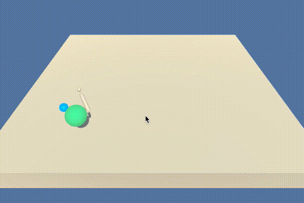

# Project 2: Continuous Control
## Udacity Deep Reinforcement Learning Nano-Degree
by Kitson Swann
submitted: 2021-04-18

This repository contains a solution to the second project of Udacity's Deep Reinforcement Learning Nano-degree.
The instructions for the project are [here](https://github.com/udacity/deep-reinforcement-learning/tree/master/p2_continuous-control).

## Reacher Environment

In this environment, our goal is to use a Deep Reinforcement Learning Agent to train a double-jointed arm to 
move its hand to a target location.

For the purpose of this assignment, the task is considered solved when the agent achieves a score of +30 
over 100 consecutive episodes.

### States

The state space contains 33 dimensions corresponding to: 

- position rotation  
- velocity
- angular velocities of the arm 

### Actions

Each action is a vector with four numbers, corresponding to torque 
applicable to two joints. Every entry in the action vector should 
be a number between -1 and 1. 

### Rewards

A reward of +0.1 is provided for each step that the agent's hand 
is in the goal location.

## Project Installation

This project requires:

- Unity
- Python 3.6

1. Clone this repository `https://github.com/kswann-mck/udacity_drl_p2.git`
2. [Install Unity](https://unity3d.com/get-unity/download)
3. Create a folder `env` inside the cloned repo, and download the zip file containing the environment 
   [here](https://s3-us-west-1.amazonaws.com/udacity-drlnd/P2/Reacher/one_agent/Reacher.app.zip) and put 
   the `Reacher.app` file in the `env` folder.
4. Create a conda environment with the requirements by doing the 
   following `conda env create --name udacity_drl_p2 --file=environment.yml python=3.6`
5. Activate the environment: `conda activate udacity_drl_p2`
6. Run jupyter lab with `jupyterlab`
7. Open the [Report.ipynb](Report.ipynb) file in jupyter lab.

## Project Structure

- [model.py](model.py) - defines the structure of the neural network using PyTorch
- [agent.py](dqn_agent.py) - defines the agent implementation including the learning step
- [train.py](train.py) - defines the training loop to run a training sequence with a given set of hyperparameters
- [optimize.py](optimize.py) - defines an optimization routine to search for optimal hyperparameters
- [Report.ipynb](Report.ipynb) - defines the solution steps, algorithm and outputs from different training and optimiztion runs
- [checkpoint_base_model.pth](checkpoint_base_model.pth) - the saved model weights from the initial parameter choices 
- [checkpoint_optimal_model.pth](checkpoint_optimal_model.pth) - the saved model weights from the initial parameter choices
- [playing.gif](playing.gif) - a gif of the trained optimal agent playing
- [environment.yml](environment.yml) - the conda environment file for reproducing the experiment

## Instructions

After you have successfully installed units and set up the python 3.6 environment and the conda environment 
requirements. If you wish, you can re-run the experiment by re-running all the cells in 
the [Report.ipynb](Report.ipynb). Note that the hyper-parameter search takes on the order of hours to run 
without a GPU so don't re-run that if you don't have time.

